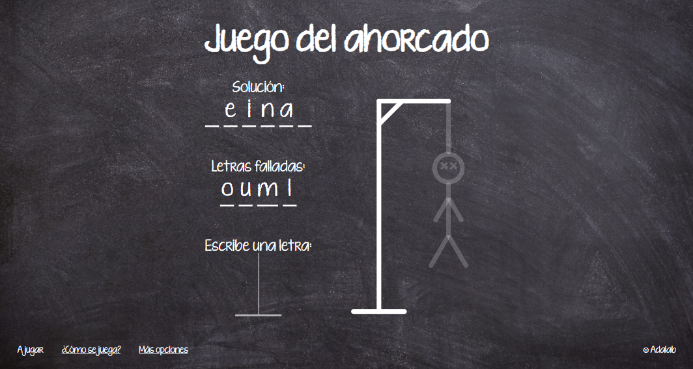
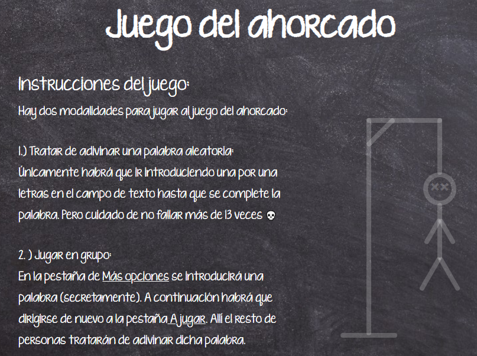

# Hangman Game

Hi! I'm Andrea Aguado :) and this exercise started as a pair-programming project during the Adalab bootcamp.
This exercise is meant to show my newly acquired skills using **React** (but still will be using **HTML, CSS and Javascript**) 😊
I parted from the react starter kit, that included pretty much everything needed to create the proyect.

This repository is conformed by:

- The files that are loose in the repository root, such as _package.json_ are used in the configuration of the project. In this case, the _package.json_ file was modified to be able to upload the project to _Github pages_.
- The `src/` folder: are the files of the web page such as **HTML, CSS, and the React Components and Services...**
- The `public/` and `docs/` folders.

## Game

This page shows the typical hangman game but with a twist:

- You can play by trying to guess a random word.
- You can play by choosing a word for someone else to guess.
- In the _instructions_ page you can read in more detail how to play.

| Home                                                                                                                  |                                                        Options                                                         |                                                                                                                     Instructions |
| :-------------------------------------------------------------------------------------------------------------------- | :--------------------------------------------------------------------------------------------------------------------: | -------------------------------------------------------------------------------------------------------------------------------: |
|  |  |  |

Hope you like my page, to see the final result visit [my github pages](https://andreaaguado.github.io/hangman-game/) 🤗

## Quick Start Guide

> **NOTE:** You need to have [Node JS](https://nodejs.org/) installed to work with this Starter Kit:

### Steps to follow every time we want to start a project from scratch:

1. \*\*Create your own repository.
1. Download this **Starter kit from GitHub**.
1. **Copy all the files** from this Starter kit to the root folder of your repository.
1. **Open a terminal** in the root folder of your repository.
1. **Install the local dependencies** by running in the terminal the command:

```bash
npm install
```

### Steps to start the project:

Once we have installed the dependencies, let's start the project. \*\*The project has to be started every time you start programming:

```bash
npm start
```

This command:

- **Opens a Chrome window and displays your web page**, just like when using the VS Code Live Server plugin.
- It also **watches** all the files inside the `src/` folder, so that every time you modify a file it **refreshes your page in Chrome**.
- It also **processes the files** HTML, SASS / CSS and JS and **generates and saves them in the `public/`** folder. For example:
  - Converts SASS files to CSS.
  - Combine the different HTML files and group them into one or several HTML files.

After running `npm start` you can start editing all files inside the `src/` folder and program comfortably.
